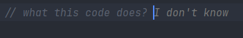
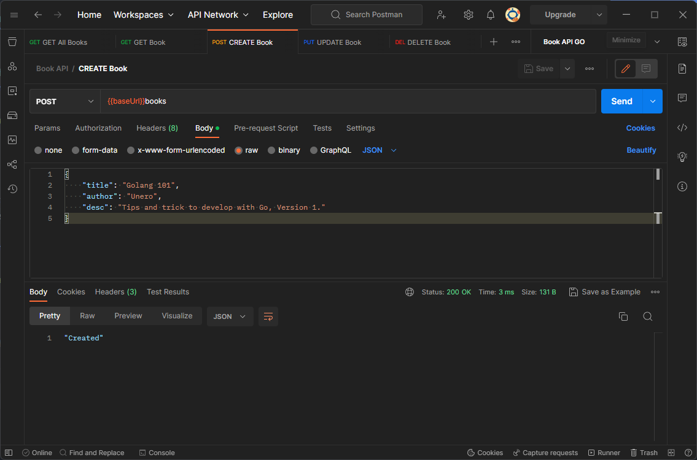
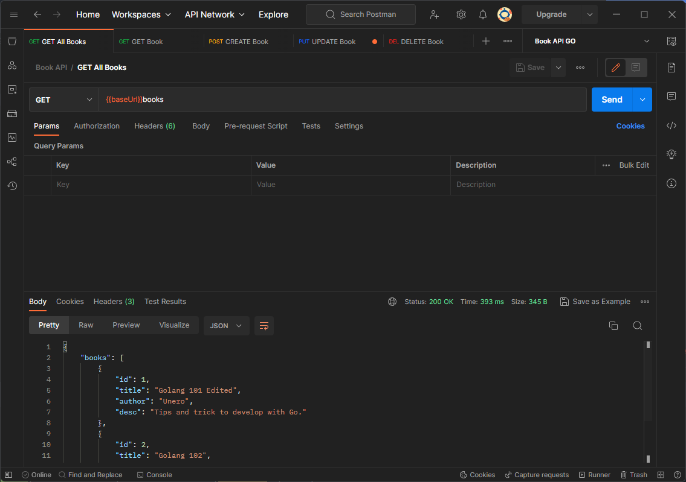
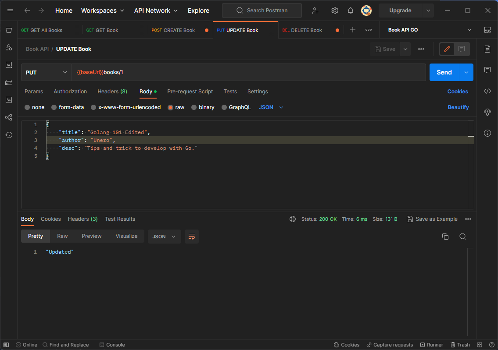
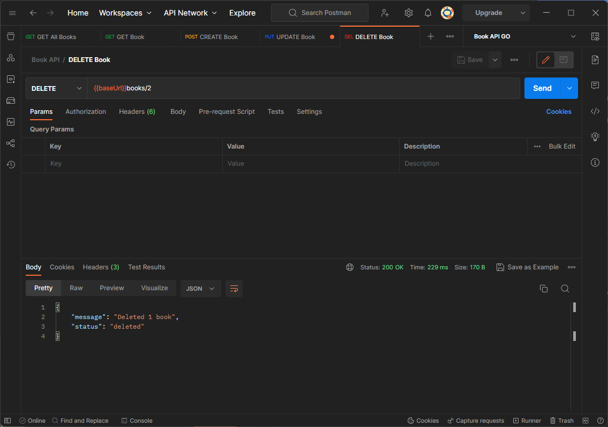

# Book API
Demonstrate how to implement a simple book api with golang with [Gin](https://www.github.com/gin-gonic/gin).

## Branches:
- main: simple api implementation
- sql: with sql implementation
- gorm: with gorm implementation

## Result

＼（〇_ｏ）／  

**CREATE** Book

**GET** Book

**GET ALL** Books

**UPDATE** Book

**DELETE** Book

