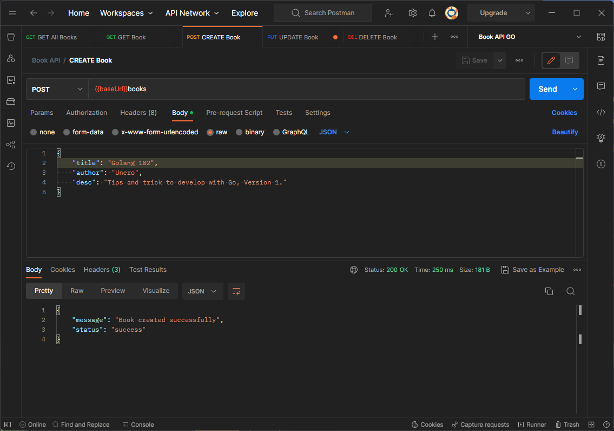
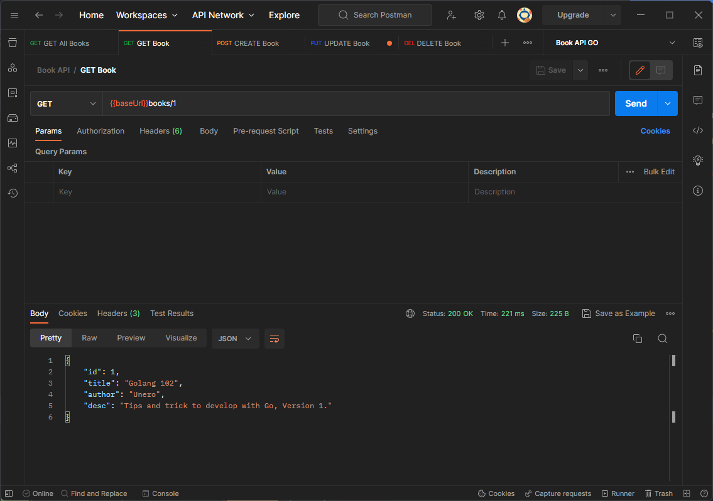
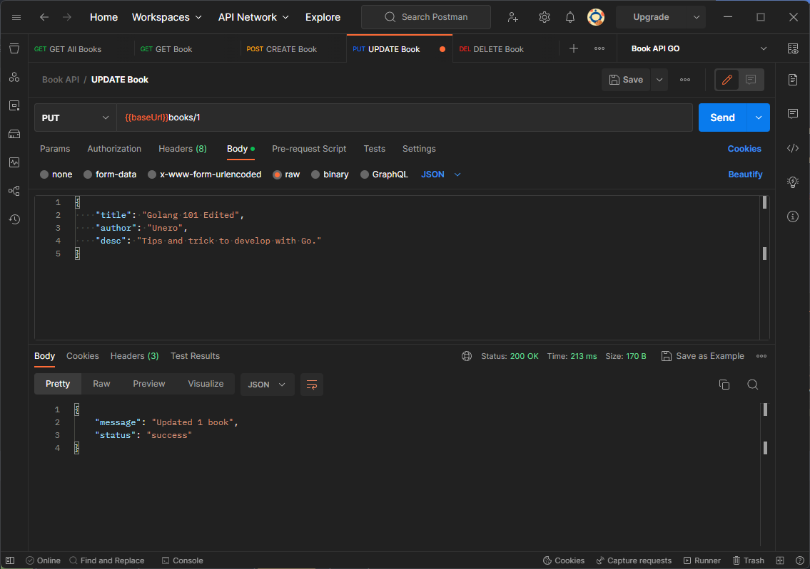

# Book API
Demonstrate how to implement a simple book api with golang using [gin](https://www.github.com/gin-gonic/gin) + `database/sql`(Postgres).

- main: simple api implementation
- sql: with sql implementation
- gorm: with gorm implementation

## Result

**CREATE** Book

**GET ALL** Books

**GET** Book

**UPDATE** Book

**DELETE** Book
